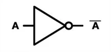
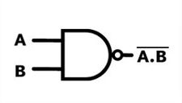
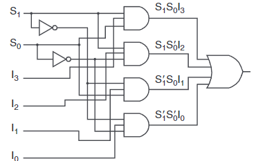
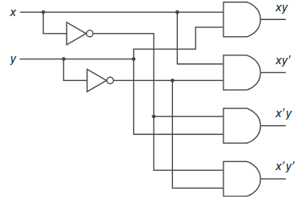

# CDA 3103 Computer Organization & Architecture - Exam 2 Review

<!-- Use 'img' tags when image resizing is needed. -->
<!-- Use 'table' tag to display images side-by-side. -->

<p style="text-align:center">
    <a href="../textbooks/CDA3103_textbook.pdf">textbook</a> |
    <a href="https://quizlet.com/845007313/cda-3103-exam-2-risc-v-logic-gate-circuits-flash-cards">quizlet</a>
</p>

### SI Unit Prefixes 
| Prefix    | Symbol    | Value         |
|-----------|-----------|---------------|
| femto-    | f         | $10^{-15}$    |
| pico-     | p         | $10^{-12}$    |
| nano-     | n         | $10^{-9}$     |
| micro-    | $\mu$     | $10^{-6}$     |
| milli-    | m         | $10^{-3}$     |
| kilo-     | k         | $10^3$        | 
| mega-     | M         | $10^6$        |
| giga-     | G         | $10^9$        |
| tera-     | T         | $10^{12}$     |
| peta-     | P         | $10^{15}$     |

## 1. Logic Gates & Combinational Circuits

- Presence of electricity in some part of a circuit is a *signal*
    - Represents `1`
    - Absence represents `0`
- Boolean expressions can be represented as a diagram of *logic gates*
    - Composed of transistors
    - All except NOT can accept any number of input (incoming) signals

### Common Logic Gates
| Name  | Symbol                                        | Requisite for Signal Output   | Boolean Equivalent            | Simplified Form   |
|-------|-----------------------------------------------|-------------------------------|-------------------------------|-------------------|
| NOT   |     | No input signal               | x', $\bar{x}$                 |                   |
| AND   |     | All input signals             | xy                            |                   |
| OR    |      | Any input signal              | x + y                         |                   |
| XOR   |     | Exactly one input signal      | x $\oplus$ y                  | x'y + xy'         |
| NAND  |    | Absence of any input signal   | (xy)'                         | x' + y'           |
| NOR   |     | No input signals              | (x + y)'                      | x'y'              |
| XNOR  |    | Equal input signals           | (x $\oplus$ y)'               | x'y' + xy         |

- From DeMorgan's Law, we can represent NAND and NOR gates in the following forms as well:

<table>
    <tr>
        <td></td>
        <td></td>
    </tr>
</table>

### Common Combinational Circuits
| Name          | Circuit Diagram                                                   | Purpose                                                                                                               | Boolean Equivalent                            |
|---------------|-------------------------------------------------------------------|-----------------------------------------------------------------------------------------------------------------------|-----------------------------------------------|
| Multiplexer   |         | Chooses one input among $2^n$ inputs ($I_0\dots I_{2^n-1}$), according to *n* selection inputs ($S_0,S_1,\dots S_n$)  | $S_1S_0I_3+S_1S_0'I_2+S_1'S_0I_1+S_1'S_0'I_0$ |
| Decoder       |     | Converts *n* inputs ($x,y,\dots$) to $2^n$ outputs                                                                    | $xy,xy',x'y,x'y'$                             |

## 3. Sequential Circuits

- Hold and use data, typically 1 bit, from previous input(s) to produce next output(s)
    - For each type, either synchronous or asynchronous
- *Synchronous* circuits respond to initial & past inputs only when clock is in specific state
    - Most sequential circuits
- *Asynchronous* circuits respond to inputs all the time (do not have a clock)
- Signal output given previous & current inputs shown by *characteristic table*
    - Similar to a truth table

<!--------------------------------------------------------------------------------------------------------------------->

### Set-Reset Latch

#### Circuit Diagram
  

#### Characteristic Table
| S (Set)   | R (Reset) | Q(t + 1)                      |
|:---------:|:---------:|:-----------------------------:|
| 0         | 0         | Q(t)                          |
| 0         | 1         | 0                             |
| 1         | 0         | 1                             |
| 1         | 1         | <small>*undefined*</small>    |

#### Properties
- Holds one bit of data
- Asynchronous

<!--------------------------------------------------------------------------------------------------------------------->

### [Set-Reset Flip-Flop](https://circuitverse.org/users/269149/projects/sr-flip-flop-0b7a0de1-fe11-40df-9094-3a27b6963370)

#### Circuit Diagram


#### Block Diagram


#### Characteristic Table
TODO TODO TODO

#### Properties
- Extends SR latch
- Only updates when a signal from a clock is received.
- Circuit is the same as a Set-Reset Latch but modified with AND gates to account for the clock.

<!--------------------------------------------------------------------------------------------------------------------->

### [D Flip-Flop](https://circuitverse.org/users/269149/projects/d-flip-flop-40d49df4-0896-410a-bbd5-16acdd8883ae)

#### Circuit Diagram


#### Block Diagram
TODO TODO TODO

#### Characteristic Table
| D (Data)  | Q(t + 1)  |
|:---------:|:---------:|
| 0         | 0         |
| 1         | 1         |

#### Properties
- A modified SR Flip-Flop in which only one input (SET) is needed.
- Reset is always the opposite of Set.
- The information stored in a D Flip-Flop is only changed when the input changes.
- Subsequent clock pulses do not effect the data stored.

<!--------------------------------------------------------------------------------------------------------------------->

### [JK Flip-Flop](https://circuitverse.org/users/269149/projects/jk-flip-flop-5d11e97f-e706-45b7-9dd6-fba45eb3f167)

#### Circuit Diagram


#### Block Diagram
TODO TODO TODO

#### Characteristic Table
| J (Set)   | K (Reset) | Q(t)  | Q(t + 1) |
|:---------:|:---------:|:-----:|:-----:|
|   0   |   0   |   0   |   0   |
|   0   |   0   |   1   |   1   |
|   0   |   1   |   0   |   0   |
|   0   |   1   |   1   |   0   |
|   1   |   0   |   0   |   1   |
|   1   |   0   |   1   |   1   |
|   1   |   1   |   0   |   1   |
|   1   |   1   |   1   |   0   |

#### Properties
- A modified SR Flip-Flop in which Set and Reset can both be 1.
- Set is denoted with J and Reset is denoted with K.
- When J and K are both 1, Q(t+1) gets set to the complement of Q(t).

<!--------------------------------------------------------------------------------------------------------------------->

Convert circuit to boolean expression by working backwards from last logic gate (give example with AST)

Additional identities

## 4. RISC-V Assembly

- *RISC-V* is a free and open-source instruction set architecture (ISA)
    - Specification defines
    - We will use RV32I, a dialect of RISC-V
- Recall registers are a small, extremely fast units of memory
    - Store 32-bit values
    - 32 in total
- Instructions operate on values in registers
    - Follows the form `inst rs, ra1, ...`
        - Instruction ID, register store, register arguments...
        - Location to store result must be made explicit
    - Are case-insensitive

### RV32I Registers
| Register      | Mnemonic/Alliance | Description                       | Use-case                  | Saver     |
|:-------------:|:-----------------:|-----------------------------------|---------------------------|-----------|
| `x0`          | `zero`            | Hard-wired zero                   | Immediate constant +TODO initialize other registers? |           |
| `x1`          | `ra`              | Return address                    |           | Caller    |
| `x2`          | `sp`              | Stack pointer                     |           | Callee    |
| `x3`          | `gp`              | Global pointer                    | <small>*we will not use this*</small> |           |
| `x4`          | `tp`              | Thread pointer                    | <small>*we will not use this*</small> |           |
| `x5`-`x7`     | `t0`-`t2`         | Temporaries                       |           | Caller    |
| `x8`          | `s0`/`fp`         | Saved register/frame pointer      |           | Callee    |
| `x9`          | `s1`              | Saved register                    |           | Callee    |
| `x10`-`x11`   | `a0`-`a1`         | Function arguments/return values  |           | Caller    |
| `x12`-`x17`   | `a2`-`a7`         | Function arguments                |           | Caller    |
| `x18`-`x27`   | `s2`-`s11`        | Saved registers                   |           | Callee    |
| `x28`-`x31`   | `t3`-`t6`         | Temporaries                       |           | Caller    |

- *Caller-saved* registers must be saved/restored by the calling function to be preserved
- *Callee-saved* registers must be saved/restored by the function being called to be preserved

>**Example:** caller saved and callee saved TODO TODO TODO
>
>
>
>
>

### R-Type Instructions

- Arithmetic, logical, and shift operations using values stored in registers
- Bitwise operations AND, OR, and XOR apply the boolean operation to every bit in the operands
    - Analogous to `&`, `|`, and `^` operators in C

>**Example:** Evaluate $10100110_2$ *AND* $01110111_2$.
>```
>10100110
>01110111
>--------
>00100110
>```
>$\checkmark$

| Instruction           | Description                                                                                                                                   |
|-----------------------|-----------------------------------------------------------------------------------------------------------------------------------------------|
| `add  rd, rs1, rs2`   | Adds `rs1` and `rs2`, storing the result in `rd`                                                                                              |
| `sub  rd, rs1, rs2`   | Subtracts `rs1` from `rs2`, storing the result in `rd`                                                                                        |
| `slt  rd, rs1, rs2`   | If `rs1` < `rs2`, 1 is stored in `rd`, or 0 otherwise<br>*Treats the operands as signed*                                                      |
| `sltu rd, rs1, rs2`   | If `rs1` < `rs2`, 1 is stored in `rd`, or 0 otherwise<br>*Treats the operands as unsigned*                                                    |
| `and  rd, rs1, rs2`   | Bitwise AND on `rs1` and `rs2`, storing the result in `rd`                                                                                    |
| `or   rd, rs1, rs2`   | Bitwise OR on `rs1` and `rs2`, storing the result in `rd`                                                                                     |
| `xor  rd, rs1, rs2`   | Bitwise XOR on `rs1` and `rs2`, storing the result in `rd`                                                                                    |
| `sll  rd, rs1, rs2`   | Logical left shift on `rs1`<br>*Shift amount is 5 least significant bits of `rs2`<br>Inserts zeros where previous LSB were*                   |
| `srl  rd, rs1, rs2`   | Logical right shift on `rs1`<br>*Shift amount is 5 least significant bits of `rs2`<br>Inserts zeros where previous MSB were*                  |
| `sra  rd, rs1, rs2`   | Arithmetic right shift on `rs1`<br>*Shift amount is 5 least significant bits of `rs2`<br>Inserts previous sign bit where previous MSB were*   |

### I-Type Instructions

- I-type instruction use-cases
    - Arithmetic, logical, and shift operations using immediates (constants)
    - Reading from memory
- Arithmetic, logical, and shifting is similar to R-Type. `rs2` gets replaced by `Imm` which is a 12-bit value with a data range of [-2048, 2047].

| Instruction           | Description                                                                               |
|-----------------------|-------------------------------------------------------------------------------------------|
| `addi rd, rs1, imm`   | Adds `rs1` and `imm`, storing the result in `rd`<br>*No `subi`, as `imm` can be negative* |
| `slti rd, rs1, imm`   | 
| `sltiu rd, rs1, imm`  | 
| `andi rd, rs1, imm`   |
| `ori ` |
| `xori ` |
| `slli ` |
| `srli ` |
| `sri `
| `lb ` |  
| `lh `|
| `lw `|
| `lbu `|
| `lhu `|

### S-Type Instructions

-

| Instruction           | Description                                                                               |
|-----------------------|-------------------------------------------------------------------------------------------|
|
|
|
|
|
|
|

#### Arithmetic Instructions
- Useful for initializing constants from C code. Example `ADDI t0, zero, 20 #t0 = 20`. TODO example

- Compares the signed values of `rs1` and `Imm`. If `rs1` is less than `Imm`, then `rd` will be 1. Otherwise, `rd` will be 0.

- Compares the signed values of `rs1` and `Imm`. If `rs1` is less than `Imm`, then `rd` will be 1. Otherwise, `rd` will be 0.

#### Logical Instructions
`ANDI rd, rs1, Imm`
- Does logical and using the values of `rs1` and `Imm` on each bit and stores the result in `rd`.
- The ANDI instruction can be used to clear some specific bits since `x and 0 = 0`.
- The ANDI instruction can also be used to find the modulo of 2^n. Example C: `X % 16` -> Example RISC-V: `ANDI t1, t0, 15`.

`ORI rd, rs1, Imm`
- Does logical or using the values of `rs1` and `Imm` on each bit and stores the result in `rd`.
- The ORI instruction can be used to set some specific bits since `x or 1 = 1`.

`XORI rd, rs1, Imm`
- Does logical exclusive or using the values of `rs1` and `Imm` on each bit and stores the result in `rd`.
- There is no NOT instruction in RISC-V, but XORI can be used in it's place: `XORI t1, t0, -1 # t1 = NOT t0`

#### Shifting Instructions
`SLLI rd, rs1, Imm`
- Does logical left shifting on `rs1` by the value of `Imm`. Inserts zeros to the least significant bit and shifts out the most significant bit.
- Can be used for multipling with 2^n constants. Example: `SLLI t2, t0, 2 # t2 = t0 * 4`
- If the constant is not a power of 2, then use multiple left shifts and add together at the end. Example:

```
C: j = h * 6

RISC-V:
SLLI t1, t0, 1 # t1 = t0 * 2
SLLI t2, t0, 2 # t2 = t0 * 4
ADD t3, t1, t2 # t3 = t1 + t2 = 6 * t0
```

`SRLI rd, rs1, Imm`
- Does logical right shifting on `rs1` by the value of `Imm`. Inserts zeros to the most significant bit and shifts out the least significant bit.

`SRAI rd, rs1, Imm`
- Does arithmetic right shifting on `rs1` by the value of `Imm`. Inserts sign bit to the most significant bit and shifts out the least significant bit.
- Can be used for dividing with 2^n constants. Example: `SRAI t1, t0, 1 # t1 = t0/2`

#### Memory Reading Instructions
Used for reading values from arrays.

`LB rd, Imm(rs1)`
- Loads 1 byte (8-bits) from the memory address `rs1` + `Imm` offset and sign extends it.

`LH rd, Imm(rs1)`
- Loads 2 bytes (16-bits) from the memory address `rs1` + `Imm` offset and sign extends it.

`LW rd, Imm(rs1)`
- Loads 4 bytes (32-bits) from the memory address `rs1` + `Imm` offset.

`LBU rd, Imm(rs1)`
- Loads 1 byte (8-bits) from the memory address `rs1` + `Imm` offset and zero extends it.

`LHU rd, Imm(rs1)`
- Loads 2 bytes (16-bits) from the memory address `rs1` + `Imm` offset and zero extends it.

### S-Type Instructions
Used for writing values to arrays.

`SB rs2, Imm(rs1)`
- Saves lower 1 byte (8-bits) of `rs2` to the memory address `rs1`  + `Imm` offset.

`SH rs2, Imm(rs1)`
- Saves lower 2 byte (16-bits) of `rs2` to the memory address `rs1`  + `Imm` offset.

`SW rs2, Imm(rs1)`
- Saves 4 byte (32-bits) of `rs2` to the memory address `rs1`  + `Imm` offset.

### U-Type Instructions
`LUI rd, Imm`
- Used to initialize big values with `Imm` (20-bits) in the upper bits of `rd`. Examples:
```
0xABCDE265

LUI t0, 0xABCDE
ADDI t0, t0, 0x265

0xABCDE965
LUI t1, 0xABCDF
ADDI t1, t1, 0x965
```
- If d11 in the hex value is 1 (Ex: 9 = 1001), then add one to `Imm` as shown in the 2nd example.


### B-Type Instructions
Used for comparing values between registers to jump to different branches of RISC-V code.

`BEQ rs1, rs2, Imm`
- Compares `rs1` and `rs2`. If **they are equal** then go to `Imm` branch.

`BNE rs1, rs2, Imm`
- Compares `rs1` and `rs2`. If **they are not equal** then go to `Imm` branch.

`BLT rs1, rs2, Imm`
- Compares `rs1` and `rs2`. If **`rs1` is less than `rs2`** then go to `Imm` branch. Signed Comparison.
- If you have `a > c` in C code, then you can make the same comparison using `BLT` *but switch the values around*.

`BGE rs1, rs2, Imm`
- Compares `rs1` and `rs2`. If **`rs1` is greater than or equal to `rs2`** then go to `Imm` branch. Signed Comparison.
- If you have `a <= c` in C code, then you can make the same comparison using `BGE` *but switch the values around*.

`BLTU rs1, rs2, Imm`
- Compares `rs1` and `rs2`. If **`rs1` is less than `rs2`** then go to `Imm` branch. Unsigned Comparison.
- If you have `a > c` in C code, then you can make the same comparison using `BLTU` *but switch the values around*.

`BGEU rs1, rs2, Imm`
- Compares `rs1` and `rs2`. If **`rs1` is greater than or equal to `rs2`** then go to `Imm` branch. Unsigned Comparison.
- If you have `a <= c` in C code, then you can make the same comparison using `BGEU` *but switch the values around*.

***WIP***